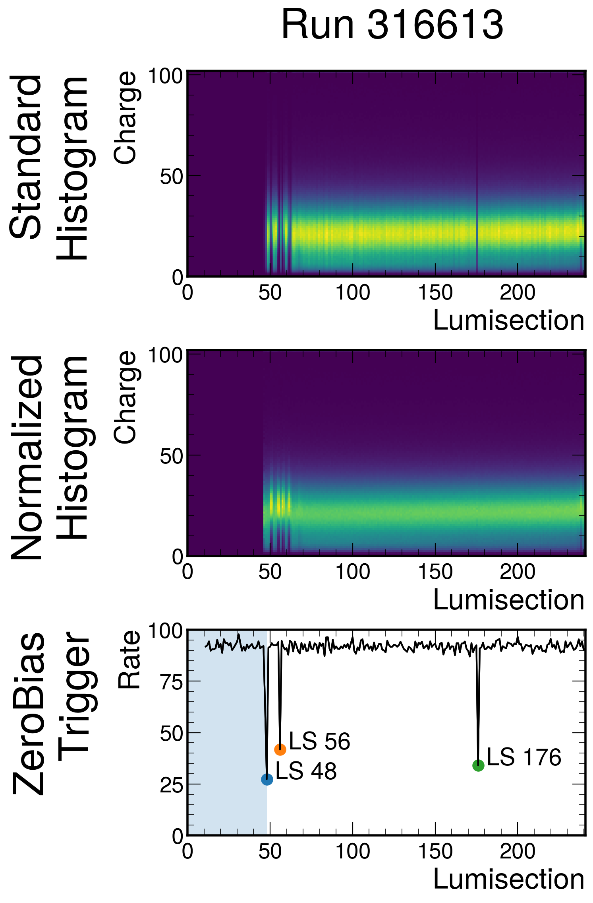
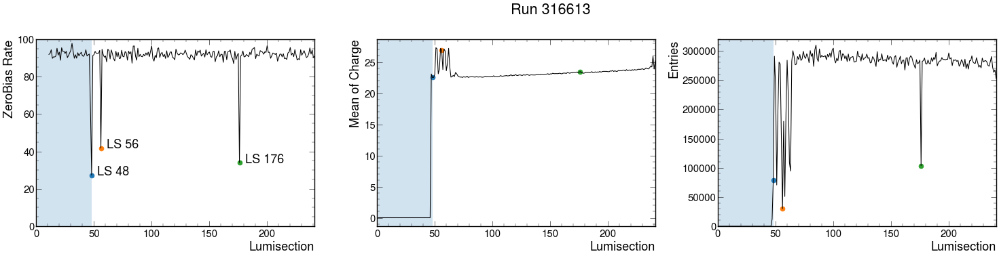
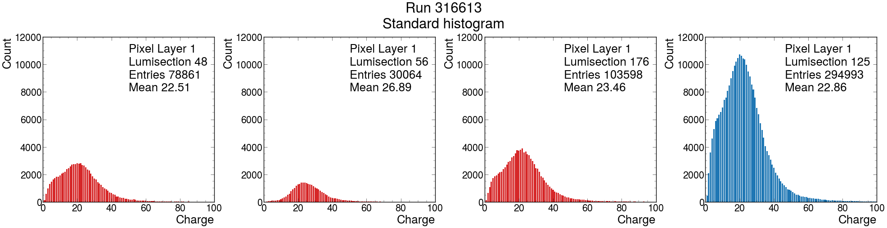
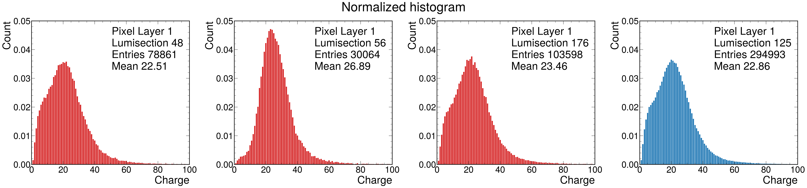

This repository's goal is to show the result of the second folded of project, we demonstrated the correlation between drop in ZeroBias trigger rate and the monitoring histogram, that is the *chargeInner_PXLayer_1* as a represent monitoring element. 

This is the graphic comparing the histogram distribution and ZeroBias rate. 

Here is the histogram showing the lumisections at which trigger rates drop.

